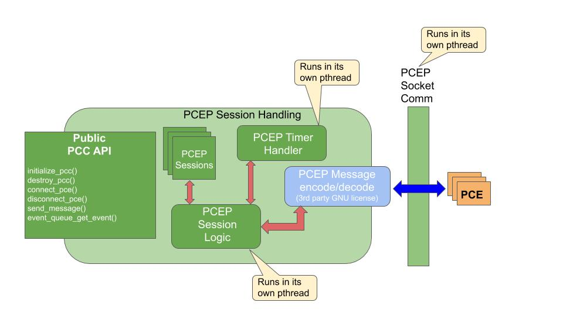
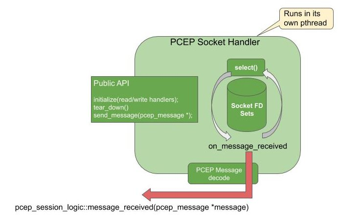
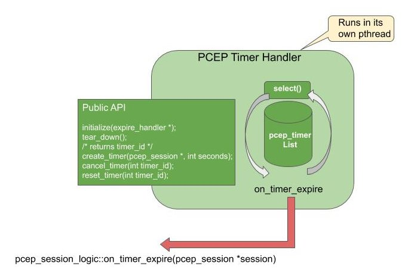
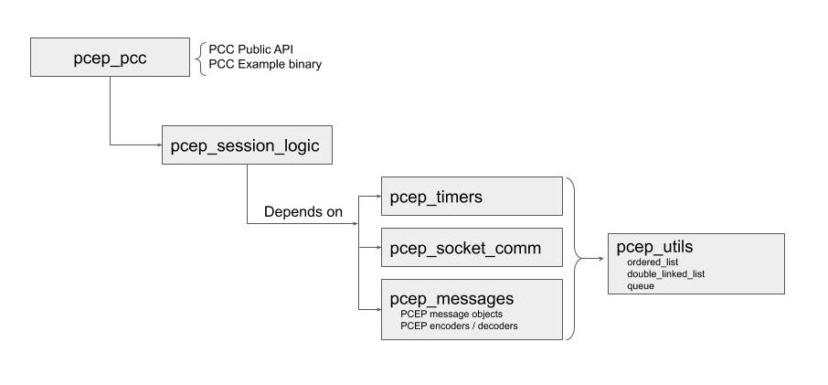
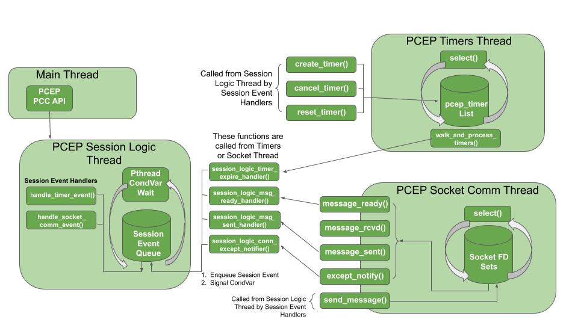
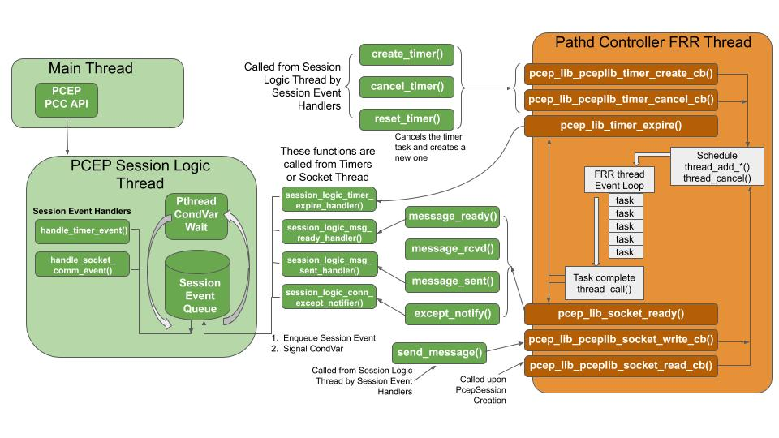

  

  

# PCEPlib

The PCEPlib is a PCEP implementation library that can be used by either a PCE
or PCC.

Currently, only the FRR pathd has been implemented as a PCC with the PCEPlib.
The PCEPlib is able to simultaneously connect to multiple PCEP peers and can
maintain persistent PCEP connections.

## PCEPlib compliance

The PCEPlib implements version 1 of the PCEP protocol, according to [RFC 5440](https://tools.ietf.org/html/rfc5440).

Additionally, the PCEPlib implements the following PCEP extensions:

* [RFC 8281](https://tools.ietf.org/html/rfc8281) PCE initiated for PCE-Initiated LSP Setup
* [RFC 8231](https://tools.ietf.org/html/rfc8231) Extensions for Stateful PCE
* [RFC 8232](https://tools.ietf.org/html/rfc8232) Optimizations of Label Switched Path State Synchronization Procedures for a Stateful PCE
* [RFC 8282](https://tools.ietf.org/html/rfc8282) Extensions to PCEP for Inter-Layer MPLS and GMPLS Traffic Engineering
* [RFC 8408](https://tools.ietf.org/html/rfc8408) Conveying Path Setup Type in PCE Communication Protocol (PCEP) Messages
* [draft-ietf-pce-segment-routing-07](https://tools.ietf.org/html/draft-ietf-pce-segment-routing-07),
  [draft-ietf-pce-segment-routing-16](https://tools.ietf.org/html/draft-ietf-pce-segment-routing-16),
  [RFC 8664](https://tools.ietf.org/html/rfc8664) Segment routing protocol extensions
* [RFC 7470](https://tools.ietf.org/html/rfc7470) Conveying Vendor-Specific Constraints
* [Draft-ietf-pce-association-group-10](https://tools.ietf.org/html/draft-ietf-pce-association-group-10)
  Establishing Relationships Between Sets of Label Switched Paths
* [Draft-barth-pce-segment-routing-policy-cp-04](https://tools.ietf.org/html/draft-barth-pce-segment-routing-policy-cp-04)
  Segment Routing Policy Candidate Paths

## PCEPlib Architecture

The PCEPlib is comprised of the following modules, each of which will be
detailed in the following sections.

* **pcep_messages**
    * PCEP messages, objects, and TLVs implementations
* **pcep_pcc**
    * PCEPlib public PCC API with a sample PCC binary
* **pcep_session_logic**
    * PCEP Session handling
* **pcep_socket_comm**
    * Socket communications
* **pcep_timers**
    * PCEP timers
* **pcep_utils**
    * Internal utilities used by the PCEPlib modules.

The interaction of these modules can be seen in the following diagram.

### PCEP Session Logic library

The PCEP Session Logic library orchestrates calls to the rest of the PCC libraries.

PCEP Session Logic library responsibilities:
* Handle messages received from “PCEP Socket Comm”
* Create and manage “PCEP Session” objects
* Set timers and react to timer expirations
* Manage counters

The PCEP Session Logic library will have 2 main triggers controlled by a
pthread condition variable:
* Timer expirations - `on_timer_expire()` callback
* Messages received from PCEP SocketComm - `message_received()` callback

The counters are created and managed using the `pcep_utils/pcep_utils_counters.h`
counters library. The following are the different counter groups managed:

* **COUNTER_SUBGROUP_ID_RX_MSG**
* **COUNTER_SUBGROUP_ID_TX_MSG**
* **COUNTER_SUBGROUP_ID_RX_OBJ**
* **COUNTER_SUBGROUP_ID_TX_OBJ**
* **COUNTER_SUBGROUP_ID_RX_SUBOBJ**
* **COUNTER_SUBGROUP_ID_TX_SUBOBJ**
* **COUNTER_SUBGROUP_ID_RX_RO_SR_SUBOBJ**
* **COUNTER_SUBGROUP_ID_TX_RO_SR_SUBOBJ**
* **COUNTER_SUBGROUP_ID_RX_TLV**
* **COUNTER_SUBGROUP_ID_TX_TLV**
* **COUNTER_SUBGROUP_ID_EVENT**

The counters can be obtained and reset as explained later in the PCEPlib PCC API.

### PCEP Socket Comm library

PCEP communication can be configured to be handled internally in this simple
library. When this library is instantiated by the PCEP Session Logic, callbacks
are provided to handle received messages and error conditions. 

The following diagram illustrates how the library works.

### PCEP Timers library

Timers can be configured to be handled internally by this library. When this
library is instantiated by the PCEP Session Logic, callbacks are provided to
handle timer expirations. The following timers are implemented and handled,
according to [RFC 5440](https://tools.ietf.org/html/rfc5440).

* Open KeepWait (fixed at 60 seconds)
    * Set once the PCC sends an Open, and if it expires before receiving a KeepAlive or PCErr, then the PCC should send a PCErr and close the TCP connection

* Keepalive timer
    * How often the PCC should send Keepalive messages to the PCE (and vice-versa)
    * The timer will be reset after any message is sent: any message serves as a Keepalive

* DeadTimer
    * If no messages are received before expiration, the session is declared as down
    * Reset everytime any message is received

* PCReq request timer
    * How long the PCC waits for the PCE to reply to PCReq messages.

### PCEP Messages library

The PCEP Messages library has all of the implemented PCEP messages, objects,
TLVs, and related functionality.

The following header files can be used for creating and handling received PCEP
entities.

* pcep-messages.h
* pcep-objects.h
* pcep-tlvs.h

#### PCEP Messages

The following PCEP messages can be created and received:

* `struct pcep_message*  pcep_msg_create_open(...);`
* `struct pcep_message*  pcep_msg_create_open_with_tlvs(...);`
* `struct pcep_message*  pcep_msg_create_request(...);`
* `struct pcep_message*  pcep_msg_create_request_ipv6(...);`
* `struct pcep_message*  pcep_msg_create_reply(...);`
* `struct pcep_message*  pcep_msg_create_close(...);`
* `struct pcep_message*  pcep_msg_create_error(...);`
* `struct pcep_message*  pcep_msg_create_error_with_objects(...);`
* `struct pcep_message*  pcep_msg_create_keepalive(...);`
* `struct pcep_message*  pcep_msg_create_report(...);`
* `struct pcep_message*  pcep_msg_create_update(...);`
* `struct pcep_message*  pcep_msg_create_initiate(...);`

Refer to `pcep_messages/include/pcep-messages.h` and the API section
below for more details.

#### PCEP Objects

The following PCEP objects can be created and received:

* `struct pcep_object_open*             pcep_obj_create_open(...);`
* `struct pcep_object_rp*               pcep_obj_create_rp(...);`
* `struct pcep_object_notify*           pcep_obj_create_notify(...);`
* `struct pcep_object_nopath*           pcep_obj_create_nopath(...);`
* `struct pcep_object_association_ipv4* pcep_obj_create_association_ipv4(...);`
* `struct pcep_object_association_ipv6* pcep_obj_create_association_ipv6(...);`
* `struct pcep_object_endpoints_ipv4*   pcep_obj_create_endpoint_ipv4(...);`
* `struct pcep_object_endpoints_ipv6*   pcep_obj_create_endpoint_ipv6(...);`
* `struct pcep_object_bandwidth*        pcep_obj_create_bandwidth(...);`
* `struct pcep_object_metric*           pcep_obj_create_metric(...);`
* `struct pcep_object_lspa*             pcep_obj_create_lspa(...);`
* `struct pcep_object_svec*             pcep_obj_create_svec(...);`
* `struct pcep_object_error*            pcep_obj_create_error(...);`
* `struct pcep_object_close*            pcep_obj_create_close(...);`
* `struct pcep_object_srp*              pcep_obj_create_srp(...);`
* `struct pcep_object_lsp*              pcep_obj_create_lsp(...);`
* `struct pcep_object_vendor_info*      pcep_obj_create_vendor_info(...);`
* `struct pcep_object_ro*               pcep_obj_create_ero(...);`
* `struct pcep_object_ro*               pcep_obj_create_rro(...);`
* `struct pcep_object_ro*               pcep_obj_create_iro(...);`
* `struct pcep_ro_subobj_ipv4*          pcep_obj_create_ro_subobj_ipv4(...);`
* `struct pcep_ro_subobj_ipv6*          pcep_obj_create_ro_subobj_ipv6(...);`
* `struct pcep_ro_subobj_unnum*         pcep_obj_create_ro_subobj_unnum(...);`
* `struct pcep_ro_subobj_32label*       pcep_obj_create_ro_subobj_32label(...);`
* `struct pcep_ro_subobj_asn*           pcep_obj_create_ro_subobj_asn(...);`
* `struct pcep_ro_subobj_sr*            pcep_obj_create_ro_subobj_sr_nonai(...);`
* `struct pcep_ro_subobj_sr*            pcep_obj_create_ro_subobj_sr_ipv4_node(...);`
* `struct pcep_ro_subobj_sr*            pcep_obj_create_ro_subobj_sr_ipv6_node(...);`
* `struct pcep_ro_subobj_sr*            pcep_obj_create_ro_subobj_sr_ipv4_adj(...);`
* `struct pcep_ro_subobj_sr*            pcep_obj_create_ro_subobj_sr_ipv6_adj(...);`
* `struct pcep_ro_subobj_sr*            pcep_obj_create_ro_subobj_sr_unnumbered_ipv4_adj(...);`
* `struct pcep_ro_subobj_sr*            pcep_obj_create_ro_subobj_sr_linklocal_ipv6_adj(...);`

Refer to `pcep_messages/include/pcep-objects.h` and the API section
below for more details.

#### PCEP TLVs

The following PCEP TLVs (Tag, Length, Value) can be created and received:

* Open Object TLVs

    * `struct pcep_object_tlv_stateful_pce_capability*    pcep_tlv_create_stateful_pce_capability(...);`
    * `struct pcep_object_tlv_lsp_db_version*             pcep_tlv_create_lsp_db_version(...);`
    * `struct pcep_object_tlv_speaker_entity_identifier*  pcep_tlv_create_speaker_entity_id(...);`
    * `struct pcep_object_tlv_path_setup_type*            pcep_tlv_create_path_setup_type(...);`
    * `struct pcep_object_tlv_path_setup_type_capability* pcep_tlv_create_path_setup_type_capability(...);`
    * `struct pcep_object_tlv_sr_pce_capability*          pcep_tlv_create_sr_pce_capability(...);`

* LSP Object TLVs

    * `struct pcep_object_tlv_ipv4_lsp_identifier*        pcep_tlv_create_ipv4_lsp_identifiers(...);`
    * `struct pcep_object_tlv_ipv6_lsp_identifier*        pcep_tlv_create_ipv6_lsp_identifiers(...);`
    * `struct pcep_object_tlv_symbolic_path_name*         pcep_tlv_create_symbolic_path_name(...);`
    * `struct pcep_object_tlv_lsp_error_code*             pcep_tlv_create_lsp_error_code(...);`
    * `struct pcep_object_tlv_rsvp_error_spec*            pcep_tlv_create_rsvp_ipv4_error_spec(...);`
    * `struct pcep_object_tlv_rsvp_error_spec*            pcep_tlv_create_rsvp_ipv6_error_spec(...);`
    * `struct pcep_object_tlv_nopath_vector*              pcep_tlv_create_nopath_vector(...);`
    * `struct pcep_object_tlv_vendor_info*                pcep_tlv_create_vendor_info(...);`
    * `struct pcep_object_tlv_arbitrary*                  pcep_tlv_create_tlv_arbitrary(...);`

* SRPAG (SR Association Group) TLVs

    * `struct pcep_object_tlv_srpag_pol_id *pcep_tlv_create_srpag_pol_id_ipv4(...);`
    * `struct pcep_object_tlv_srpag_pol_id *pcep_tlv_create_srpag_pol_id_ipv6(...);`
    * `struct pcep_object_tlv_srpag_pol_name *pcep_tlv_create_srpag_pol_name(...);`
    * `struct pcep_object_tlv_srpag_cp_id *pcep_tlv_create_srpag_cp_id(...);`
    * `struct pcep_object_tlv_srpag_cp_pref *pcep_tlv_create_srpag_cp_pref(...);`

Refer to `pcep_messages/include/pcep-tlvs.h` and the API section
below for more details.

### PCEP PCC

This module has a Public PCC API library (explained in detail later) and a
sample PCC binary.  The APIs in this library encapsulate other PCEPlib libraries
for simplicity. With this API, the PCEPlib PCC can be started and stopped, and
the PCEPlib event queue can be accessed. The PCEP Messages library is not
encapsulated, and should be used directly.

### Internal Dependencies

The following diagram illustrates the internal PCEPlib library dependencies.

### External Dependencies

Originally the PCEPlib was based on the open source [libpcep project](https://www.acreo.se/open-software-libpcep),
but that dependency has been reduced to just one source file (pcep-tools.[ch]).

### PCEPlib Threading model

The PCEPlib can be run in stand-alone mode whereby a thread is launched for 
timers and socket comm, as is illustrated in the following diagram.

The PCEPlib can also be configured to use an external timers and socket
infrastructure like the FRR threads and tasks. In this case, no internal
threads are launched for timers and socket comm, as is illustrated in the
following diagram.

## Building, Installing, and Testing the PCEPlib

The PCEPlib PCC is implemented as multiple libraries, each with separate include
headers per library.

The project or individual libraries can be built, cleaned, and tested as follows:

### Building

An individual library is built with the `make` command with no targets
specified. The object files are written to the `obj` directory at the library
root directory, and the library is written to the `build` directory at the
project root directory.

Executing the `make` command from the project root directory will build the
entire project. The `all` target can optionally be specified.

### Building with clang-tidy and gcov

The clang tool performs static code analysis on the source code, while the gcov
tool reports Unit Test coverage.  The following 3 scripts are used to run the
clang and gcov tools on the source code:

* **reports/install.sh** - Installs the clang and gcov tools
* **reports/analyze.sh** - Runs the clang tool on the source code
* **reports/cov.sh** - Runs the gcov tool on the Unit Tests

The results are stored in the following files:
* reports/coverage
* reports/clang-tidy-report

The results of the last Gitlab pipeline build can be also seen in the Volta
[SonarQube](http://192.168.254.199:9000/dashboard?id=pceplib), while connected
to the Volta VPN.

### Cleaning

An individual library is cleaned with the `make clean` command. This will 
remove all object files from the library `obj` directory and remove the
library from the project `build` directory.

Executing the `make clean` command from the project root directory will clean
the entire project.

### Testing

The Unit Tests for an individual library are executed with the `make test`
command. The Unit Test binary will be written to the project `build` directory.
All Unit Tests are executed with Valgrind, and any memory issues reported by
Valgrind will cause the Unit Test to fail.

Executing the `make test` command from the project root directory will test
the entire project.

### Installing

The libraries and headers from the entire project can be installed in the
project `install` directory by executing the `make install` command from
the project root directory.

## PCEPlib PCC API

The following sections describe the PCEPlib PCC API.

### PCEPlib PCC Initialization and Destruction

The PCEPlib can be initialized to handle memory, timers, and socket comm
internally in what is called stand-alone mode, or with an external
infrastructure, like FRR.

#### PCEPlib PCC Initialization and Destruction in stand-alone mode

PCEPlib PCC initialization and destruction functions:
* `bool initialize_pcc();`
* `bool initialize_pcc_wait_for_completion();`
* `bool destroy_pcc();`

The PCC can be initialized with either `initialize_pcc()` or
`initialize_pcc_wait_for_completion()`.
* `initialize_pcc_wait_for_completion()` blocks until `destroy_pcc()`
   is called from a separate pthread.
* `initialize_pcc()` is non-blocking and will be stopped when
  `destroy_pcc()` is called.

Both initialize functions will launch 3 pthreads:
* 1 Timer pthread
* 1 SocketComm pthread
* 1 SessionLogic pthread

When `destroy_pcc()` is called, all pthreads will be stopped and all
resources will be released.

All 3 functions return true upon success, and false otherwise.

#### PCEPlib PCC Initialization and Destruction with FRR infrastructure

PCEPlib PCC initialization and destruction functions:
* `bool initialize_pcc_infra(struct pceplib_infra_config *infra_config);`
* `bool destroy_pcc();`

The `pceplib_infra_config` struct has the following fields:
* **void *pceplib_infra_mt**
    * FRR Memory type pointer for infra related memory management
* **void *pceplib_messages_mt**
    * FRR Memory type pointer for PCEP messages related memory management
* **pceplib_malloc_func mfunc**
    * FRR malloc function pointer
* **pceplib_calloc_func cfunc**
    * FRR calloc function pointer
* **pceplib_realloc_func rfunc**
    * FRR realloc function pointer
* **pceplib_strdup_func sfunc**
    * FRR strdup function pointer
* **pceplib_free_func ffunc**
    * FRR free function pointer
* **void *external_infra_data**
    * FRR data used by FRR timers and sockets infrastructure
* **ext_timer_create timer_create_func**
    * FRR timer create function pointer
* **ext_timer_cancel timer_cancel_func**
    * FRR timer cancel function pointer
* **ext_socket_write socket_write_func**
    * FRR socket write function pointer, indicating fd is ready to be written to
* **ext_socket_read socket_read_func**
    * FRR socket write function pointer, indicating fd is ready to be read from

### PCEPlib PCC configuration

PCEPlib PCC configuratoin functions:
* `pcep_configuration *create_default_pcep_configuration();`
* `void destroy_pcep_configuration(pcep_configuration *config);`

A `pcep_configuration` object with default values is created with
`create_default_pcep_configuration()`. These values can be tailored to
specific use cases.

Created `pcep_configuration` objects are destroyed with
`destroy_pcep_configuration()`.

#### PCEPlib PCC configuration paramaters

The `pcep_configuration` object is defined in `pcep_session_logic/include/pcep_session_logic.h`
The attributes in the `pcep_configuration` object are detailed as follows.

PCEP Connection parameters:
* **dst_pcep_port**
    * Defaults to 0, in which case the default PCEP TCP destination port
      4189 will be used.
    * Set to use a specific PCEP TCP destination port.
* **src_pcep_port**
    * Defaults to 0, in which case the default PCEP TCP source port
      4189 will be used.
    * Set to use a specific PCEP TCP source port.
* **Source IP**
    * Defaults to IPv4 INADDR_ANY
    * Set **src_ip.src_ipv4** and **is_src_ipv6=false** to set the source IPv4.
    * Set **src_ip.src_ipv6** and **is_src_ipv6=true** to set the source IPv6.
* **socket_connect_timeout_millis**
    * Maximum amount of time to wait to connect to the PCE TCP socket
      before failing, in milliseconds.

PCEP Versioning:
* **pcep_msg_versioning->draft_ietf_pce_segment_routing_07**
    * Defaults to false, in which case draft 16 versioning will be used.
    * Set to true to use draft 07 versioning.

PCEP Open Message Parameters:

* **keep_alive_seconds**
    * Sent to PCE in PCEP Open Msg
    * Recommended value = 30, Minimum value = 1
    * Disabled by setting value = 0
* **dead_timer_seconds**
    * Sent to PCE in PCEP Open Msg
    * Recommended value = 4 * keepalive timer value
* Supported value ranges for PCEP Open Message received from the PCE
    * **min_keep_alive_seconds**, **max_keep_alive_seconds**
    * **min_dead_timer_seconds**, **max_dead_timer_seconds**
* **request_time_seconds**
    * When a PCC sends a PcReq to a PCE, the amount of time a PCC will
      wait for a PcRep reply from the PCE.
* **max_unknown_requests**
    * If a PCC/PCE receives PCRep/PCReq messages with unknown requests
      at a rate equal or greater than MAX-UNKNOWN-REQUESTS per minute,
      the PCC/PCE MUST send a PCEP CLOSE message.
    * Recommended value = 5
* **max_unknown_messages**
    * If a PCC/PCE receives unrecognized messages at a rate equal or
      greater than MAX-UNKNOWN-MESSAGES per minute, the PCC/PCE MUST
      send a PCEP CLOSE message
    * Recommended value = 5

Stateful PCE Capability TLV configuration parameters (RFC 8231, 8232, 8281, and
draft-ietf-pce-segment-routing-16):

* **support_stateful_pce_lsp_update**
    * If this flag is true, then a Stateful PCE Capability TLV will
      be added to the PCEP Open object, with the LSP Update Capability
      U-flag set true.
    * The rest of these parameters are used to configure the Stateful
      PCE Capability TLV
* **support_pce_lsp_instantiation**
    * Sets the I-flag true, indicating the PCC allows instantiation
      of an LSP by a PCE.
* **support_include_db_version**
    * Sets the S-bit true, indicating the PCC will include the
      LSP-DB-VERSION TLV in each LSP object. See lsp_db_version below.
* **support_lsp_triggered_resync**
    * Sets the T-bit true, indicating the PCE can trigger resynchronization
      of LSPs at any point in the life of the session.
* **support_lsp_delta_sync**
    * Sets the D-bit true, indicating the PCEP speaker allows incremental
      (delta) State Synchronization.
* **support_pce_triggered_initial_sync**
    * Sets the F-bit true, indicating the PCE SHOULD trigger initial (first)
      State Synchronization

LSP DB Version TLV configuration parameters:
* **lsp_db_version**
    * If this parameter has a value other than 0, and the above
      support_include_db_version flag is true, then an LSP DB
      Version TLV will be added to the PCEP Open object.
    * This parameter should only be set if LSP-DB survived a restart
      and is available.
    * This value will be copied over to the pcep_session upon initialization.

SR PCE Capability sub-TLV configuration parameters (draft-ietf-pce-segment-routing-16):
* **support_sr_te_pst**
    * If this flag is true, then an SR PCE Capability sub-TLV will be
      added to a Path Setup type Capability TLV, which will be added
      to the PCEP Open object.
    * The PST used in the Path Setup type Capability will be 1,
      indicating the Path is setup using Segment Routing Traffic Engineering.

Only set the following fields if the **support_sr_te_pst** flag is true.
* **pcc_can_resolve_nai_to_sid**
    * Sets the N-flag true, indicating that the PCC is capable of resolving
      a Node or Adjacency Identifier to a SID
* **max_sid_depth**
    * If set other than 0, then the PCC imposes a limit on the Maximum
      SID depth.
    * If this parameter is other than 0, then the X bit will be true,
      and the parameter value will be set in the MSD field.

### PCEPlib PCC connections

PCEPlib PCC connect and disconnect functions:
* `pcep_session *connect_pce(pcep_configuration *config, struct in_addr *pce_ip);`
* `pcep_session *connect_pce_ipv6(pcep_configuration *config, struct in6_addr *pce_ip);`
* `void disconnect_pce(pcep_session *session);`

When connecting to a PCE, a `pcep_session` will be returned on success, NULL
otherwise.

Refer to the above PCC configuration parameters section for setting the source
and destination PCEP TCP ports, and the source IP address and version.

### PCEP Messages, Objects, and TLVs

The PCEP messages, objects, and TLVs created in the PCEPlib are high-level API
structures, meaning they need to be encoded before being sent on-the-wire, and
the raw data received needs to be decoded into these structures. This makes
using these objects much easier for the library consumer, since they do not
need to know the detailed raw format of the PCEP entities.

#### PCEP Messages

Received messages (in the `pcep_event` explained below) are of type
`pcep_message`, which have the following fields:
* `struct pcep_message_header *msg_header;`
    * Defines the PCEP version and message type
* `double_linked_list *obj_list;`
    * A double linked list of the message objects
    * Each entry is a pointer to a `struct pcep_object_header`, and
      using the `object_class` and `object_type` fields, the pointer
      can be cast to the appropriate object structure to access the
      rest of the object fields
* `uint8_t *encoded_message;`
    * This field is only populated for received messages or once the
      `pcep_encode_message()` function has been called on the message.
    * This field is a pointer to the raw PCEP data for the entire
      message, including all objects and TLVs.
* `uint16_t encoded_message_length;`
    * This field is only populated for received messages or once the
      `pcep_encode_message()` function has been called on the message.
    * This field is the length of the entire raw message, including
      all objects and TLVs.
    * This field is in host byte order.
    

#### PCEP Objects

A PCEP message has a double linked list of pointers to `struct pcep_object_header`
structures, which have the following fields:
* `enum pcep_object_classes object_class;`
* `enum pcep_object_types object_type;`
* `bool flag_p;`
    * PCC Processing rule bit: When set, the object MUST be taken into
      account, when cleared the object is optional
* `bool flag_i;`
    * PCE Ignore bit: indicates to a PCC whether or not an optional
      object was processed 
* `double_linked_list *tlv_list;`
    * A double linked list of the object TLVs
    * Each entry is a pointer to a `struct pcep_object_tlv_header`, and
      using the TLV type field, the pointer can be cast to the
      appropriate TLV structure to access the rest of the TLV fields
* `uint8_t *encoded_object;`
    * This field is only populated for received objects or once the
      `pcep_encode_object()` (called by `pcep_encode_message()`)
      function has been called on the object.
    * Pointer into the encoded_message field (from the pcep_message)
      where the raw object PCEP data starts.
* `uint16_t encoded_object_length;`
    * This field is only populated for received objects or once the
      `pcep_encode_object()` (called by `pcep_encode_message()`)
      function has been called on the object.
    * This field is the length of the entire raw TLV
    * This field is in host byte order.

The object class and type can be used to cast the `struct pcep_object_header`
pointer to the appropriate object structure so the specific object fields can
be accessed.

#### PCEP TLVs

A PCEP object has a double linked list of pointers to `struct pcep_object_tlv_header`
structures, which have the following fields:
* `enum pcep_object_tlv_types type;`
* `uint8_t *encoded_tlv;`
    * This field is only populated for received TLVs or once the
      `pcep_encode_tlv()` (called by `pcep_encode_message()`)
      function has been called on the TLV.
    * Pointer into the encoded_message field (from the pcep_message)
      where the raw TLV PCEP data starts.
* `uint16_t encoded_tlv_length;`
    * This field is only populated for received TLVs or once the
      `pcep_encode_tlv()` (called by `pcep_encode_message()`)
      function has been called on the TLV.
    * This field is the length of the entire raw TLV
    * This field is in host byte order.

#### Memory management

Any of the PCEPlib Message Library functions that receive a pointer to a
`double_linked_list`, `pcep_object_header`, or `pcep_object_tlv_header`,
transfer the ownership of the entity to the PCEPlib. The memory will be freed
internally when the encapsulating structure is freed. If the memory for any of
these is freed by the caller, then there will be a double memory free error
when the memory is freed internally in the PCEPlib.

Any of the PCEPlib Message Library functions that receive either a pointer to a
`struct in_addr` or `struct in6_addr` will allocate memory for the IP
address internally and copy the IP address. It is the responsibility of the
caller to manage the memory for the IP address passed into the PCEPlib Message
Library functions.

For messages received via the event queue (explained below), the message will
be freed when the event is freed by calling `destroy_pcep_event()`.

When sending messages, the message will be freed internally in the PCEPlib when
the `send_message()` `pcep_pcc` API function when the `free_after_send` flag
is set true.

To manually delete a message, call the `pcep_msg_free_message()` function.
Internally, this will call `pcep_obj_free_object()` and `pcep_obj_free_tlv()`
appropriately.

### Sending a PCEP Report message

This section shows how to send a PCEP Report messages from the PCC to the PCE,
and serves as an example of how to send other messages. Refer to the sample
PCC binary located in `pcep_pcc/src/pcep_pcc.c` for code examples os sending
a PCEP Report message.

The Report message must have at least an SRP, LSP, and ERO object.

The PCEP Report message objects are created with the following APIs:
* `struct pcep_object_srp *pcep_obj_create_srp(...);`
* `struct pcep_object_lsp *pcep_obj_create_lsp(...);`
* `struct pcep_object_ro *pcep_obj_create_ero(...);`
    * Create ero subobjects with the `pcep_obj_create_ro_subobj_*(...);` functions

PCEP Report message is created with the following API:
* `struct pcep_header *pcep_msg_create_report(double_linked_list *report_object_list);`

A PCEP report messages is sent with the following API:
* `void send_message(pcep_session *session, pcep_message *message, bool free_after_send);`

### PCEPlib Received event queue

PCEP events and messages of interest to the PCEPlib consumer will be stored
internally in a message queue for retrieval.

The following are the event types:
* **MESSAGE_RECEIVED**
* **PCE_CLOSED_SOCKET**
* **PCE_SENT_PCEP_CLOSE**
* **PCE_DEAD_TIMER_EXPIRED**
* **PCE_OPEN_KEEP_WAIT_TIMER_EXPIRED**
* **PCC_CONNECTED_TO_PCE**
* **PCC_CONNECTION_FAILURE**
* **PCC_PCEP_SESSION_CLOSED**
* **PCC_RCVD_INVALID_OPEN**
* **PCC_SENT_INVALID_OPEN**
* **PCC_RCVD_MAX_INVALID_MSGS**
* **PCC_RCVD_MAX_UNKOWN_MSGS**

The following PCEP messages will not be posted on the message queue, as they
are handled internally in the library:
* **Open**
* **Keep Alive**
* **Close**

Received event queue API:
* `bool event_queue_is_empty();`
    * Returns true if the queue is empty, false otherwise
* `uint32_t event_queue_num_events_available();`
    * Return the number of events on the queue, 0 if empty
* `struct pcep_event *event_queue_get_event();`
    * Return the next event on the queue, NULL if empty
    * The `message` pointer will only be non-NULL if `event_type`
      is `MESSAGE_RECEIVED`
* `void destroy_pcep_event(struct pcep_event *event);`
    * Free the PCEP Event resources, including the PCEP message if present

### PCEPlib Countes

The PCEPlib counters are managed in the `pcep_session_logic` library, and can
be accessed in the `pcep_session_counters` field of the `pcep_session` structure.
There are 2 API functions to manage the counters:

* `void dump_pcep_session_counters(pcep_session *session);`
    * Dump all of the counters to the logs
* `void reset_pcep_session_counters(pcep_session *session);`

